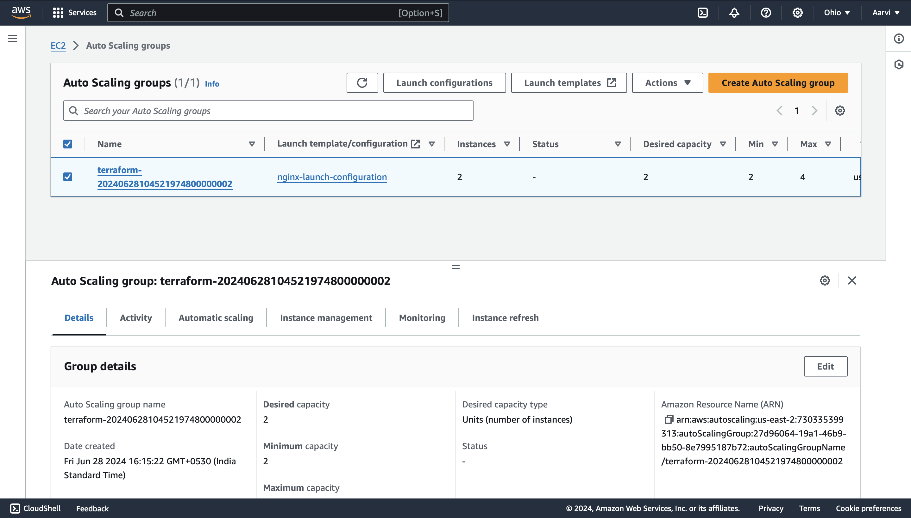

# FourJunctions--Assignment

- [Kubernetes](#kubernetes)
- [Terraform](#terraform)

## Kubernetes
1. **Setup Master and Worker Nodes**

   First, I set up a Kubernetes cluster with a master node and worker node. I configured and make them connected.
   ```sh
   kubectl get nodes


2. **Clone GitHub Repository**
   Clone the GitHub repository containing Kubernetes YAML files (`nginx-deploy.yaml`, `nginx-svc.yaml`, `ingress.yaml`).

   ```sh
   git clone https://github.com/R-holmes10/FourJunctions-DevOps.git
   cd FourJunctions-DevOps/Kubernetes


3. **Verify that the YAML files are present in the directory**
   ```sh
   cat nginx-deploy.yaml
   cat nginx-svc.yaml
   cat ingress.yaml


4. **Apply Changes to YAML Files**
   Apply the Kubernetes YAML files to create Deployment, Service, and Ingress resources.
   ```sh
   kubectl apply -f nginx-deploy.yaml
   kubectl apply -f nginx-svc.yaml
   kubectl apply -f ingress.yaml

5. **Verify Resources**
   To check that the resources (Deployments, Services, Ingresses) are created successfully.
   ```sh
   kubectl get deploy -o wide
   kubectl get svc -o wide
   kubectl get ingress -o wide
   


6. **Deployed default Nginx page on example.com** using `http://<Internal_IP_Address>:ClusterIP_Port`
   ```sh
   172.31.9.207:30262


## Terraform

1. **Installation of Terraform in the Ubuntu Instance.**
   ```sh
   wget -O- https://apt.releases.hashicorp.com/gpg | sudo gpg --dearmor -o /usr/share/keyrings/hashicorp-archive-keyring.gpg
   echo "deb [signed-by=/usr/share/keyrings/hashicorp-archive-keyring.gpg] https://apt.releases.hashicorp.com $(lsb_release -cs) main" | sudo tee       /etc/apt/sources.list.d/hashicorp.list
   sudo apt update && sudo apt install terraform
   terraform --version
   which terraform


2. **Configure AWS CLI to inject ACCESS_KEY and SECRET_KEY.**
   ```sh
   aws configure

3. **Initialising Terraform in my working directory, and Validate the syntax and configuration of the Terraform files.** 
   ```sh
   cd FourJunctions/AWS
   ls
   terraform init
   terraform validate


4. **Generate and review an execution plan for Terraform**
   ```sh
   terraform plan


5. **Now, Applying the Terraform execution plan to make changes to the infrastructure as defined in the Terraform configuration files. (`variables.tf`, `vpc.tf` ,`autoscaling.tf` and `route53.tf`)**

   **Note**: Due to the unavailability of a domain, I've skipped the Route53.tf file from terraform execution, but the file is there for the steps to be followed for the Route53                setup through terraform.
   ```sh
   terraform apply --auto-approve


6. **After the successful infrastructure creation through Terraform, two instances named `nginx-asg` are created, with Public IP and SSH disabled.**


7. **As per the configuration, an Auto-Scaling Group, subnets, NAT Gateway and VPC named `ionginx` have been created.**



   
